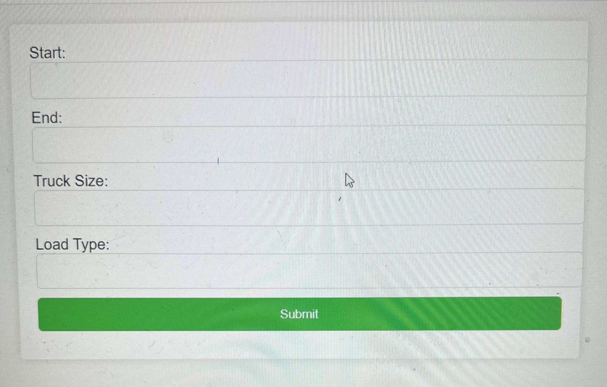
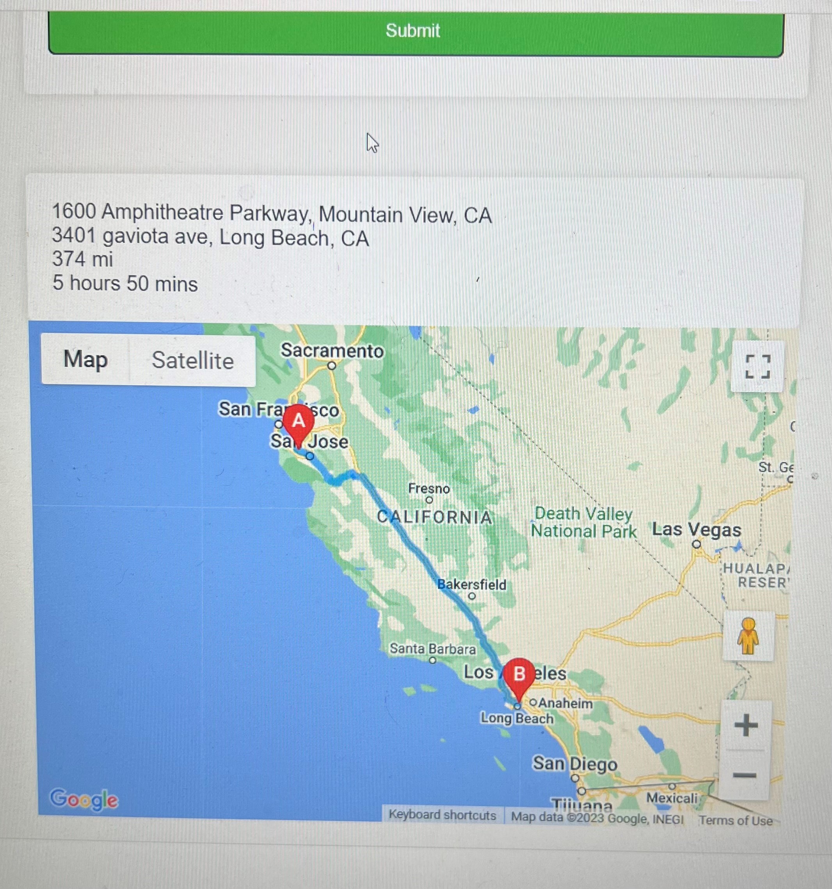

# Truck Routing App

This is a web application that helps truck drivers to plan their routes. The application uses the Google Maps API to calculate routes between start and end points that the user inputs. 

## Features

- Calculate the best route between two points.
- Provide detailed directions.
- Indicate distance and duration of the journey.
- Interactive map to display the route.

## Getting Started

These instructions will get you a copy of the project up and running on your local machine for development and testing purposes.

### Prerequisites

- PHP 7.3+
- A Google Maps API key

### Installing

1. Clone the repository: `git clone https://github.com/yourusername/your-repo.git`
2. Navigate into the project directory: `cd your-repo`
3. Install dependencies: `composer install`
4. Copy the .env.example file to .env and fill in your Google Maps API key
5. Start the PHP server: `php -S localhost:8000`

### Usage

After installation, navigate to `http://localhost:8000` in your web browser. Enter your start and end locations, truck size and load type then click "Submit".

## Deployment

Instructions for deploying to Heroku can be found in the `DEPLOYMENT.md` file.

## Built With

- [PHP](https://www.php.net/) - The server-side scripting language used.
- [Google Maps API](https://developers.google.com/maps/documentation) - Used to calculate and display routes.

.
